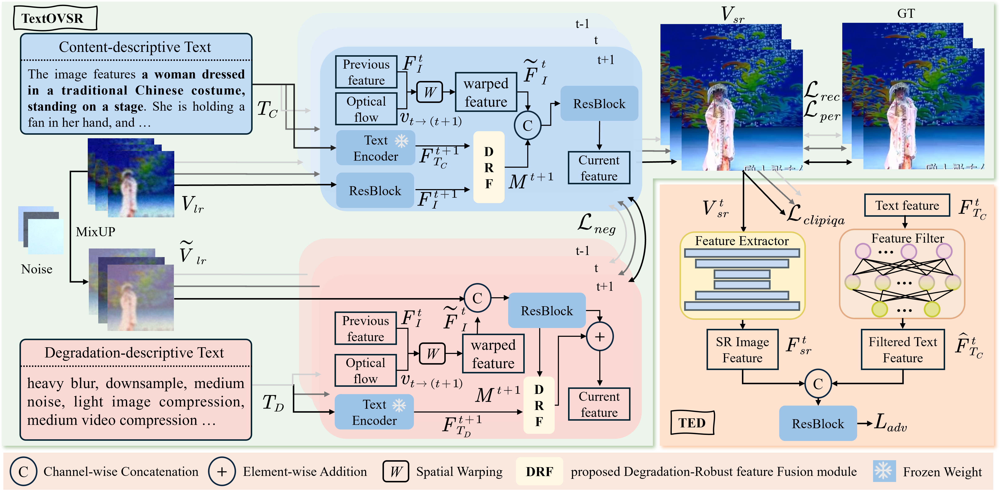
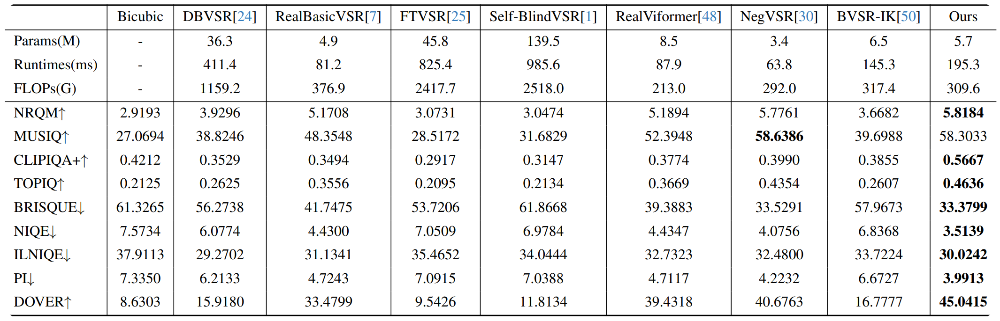
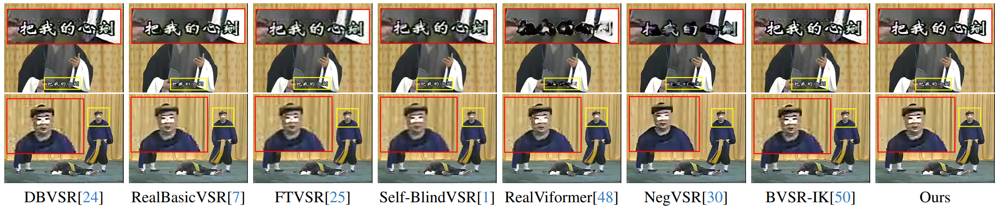

# [CVPR2026] TextOVSR: Text-Guided Real-World Opera Video Super-Resolution

<!-- <div align="center">
  
[](https://arxiv.org/abs/2511.06172)

</div> -->

<!-- <div align="center">
  
  <br>
</div> -->

# RealBasicVSR (CVPR 2022)

<!-- \[[Paper](https://arxiv.org/pdf/2111.12704.pdf)\] -->

This is the official repository of "TextOVSR: Text-Guided Real-World Opera Video Super-Resolution". This repository contains *codes*, *configs*, *datas* of our work.

**Authors**: [Hua Chang](https://github.com/ChangHua0), [Xin Xu](https://scholar.google.com/citations?user=DtuoAWIAAAAJ&hl=zh-CN), [Wei Liu](https://scholar.google.com/citations?user=EibZ-p8AAAAJ&hl=zh-CN), [Jiayi Wu], [Kui Jiang](https://scholar.google.com/citations?user=AbOLE9QAAAAJ&hl=zh-CN&oi=sra), [Fei Ma], [Qi Tian], 

## News
- 16 Mar 2026: Code released
- 10 Mar 2026: This repository created
- 21 feb 2026: Our paper has been accepted to CVPR 2022

## Table of Content
1. [Motivation](#Motivation)
2. [TextOVSR](#TextOVSR)
3. [Quantitative Results](#Quantitative-Results)
4. [Qualitative Results](#Qualitative-Results)
5. [Code](#Code)
6. [Inference](#Inference)
7. [Training](#Training)
8. [OperaLQ Dataset](#OperaLQ-Dataset)
9. [Acknowledgement](#Acknowledgement)


### **Motivation**

</summary>


</details>

<details open>
<summary>

### **TextOVSR**

</summary>



</details>

<details open>
<summary>


### **Quantitative Results**

</summary>



</details>

<details open>
<summary>

### **Qualitative Results**

</summary>



</details>


##  Code

### Environment Setup
**Dependencies**: 
  - CUDA 11.8
  - Python 3.9
  - pytorch 2.5.1
  
  Create Conda Environment
  ```
  conda create -n textovsr python=3.9
  conda activate textovsr 
  conda install pytorch torchvision torchaudio pytorch-cuda=11.8 -c pytorch -c nvidia
  pip install openmim
  mim install mmcv-full  /  pip install mmcv==2.2.0 -f https://download.openmmlab.com/mmcv/dist/cu118/torch2.x/index.html
  pip install mmedit
  pip install pyiqa
  pip install transformers==4.37.2
  pip install diffusers==0.29.2
  ```
  


### Inference
Before running the inference code, copy the code from the Python files in the `codes` directory to the `mmedit` package in your execution environment. For example, copy `codes/basicvsr_net.py` to `/.conda/envs/textovsr/lib/python3.9/site-packages/mmedit/models/backbones/sr_backbones/basicvsr_net.py`. The target path for `codes/unet_disc.py` is `/. conda/envs/textovsr/lib/python3.9/site-packages/mmedit/models/components/discriminators/unet_disc.py`.

  1. Download the [pre-trained model](https://pan.baidu.com/s/1wDTn0bYAHPOupexb8JhvWA) Code[9527]
    <!-- Pre-training models will be disclosed later -->
  2. set config in configs/textovsr_×4.py
  ```python
    data = dict(
      workers_per_gpu=10,
      # test
      test=dict(
          type=val_dataset_type,
          lq_folder='/OperaLQ/', # your testset path
          gt_folder='/OperaLQ/', # your testset path
          # num_input_frames=10,
          pipeline=test_pipeline,
          scale=4,
          test_mode=True),
    )
  ```
  3. run the following command:
  ```python
  nohup python /.conda/envs/textovsr/lib/python3.9/site-packages/mmedit/.mim/tools/test.py --config configs/textovsr_×4.py --checkpoint checkpoint_save_path --out save_path/result.pkl --save-path save_path/images/ --launcher none >> test_textovsr.out 2>&1 &
  ```

### Training
The training is divided into two stages:
1. Train a model without perceptual loss, adversarial loss and clipiqa loss using [configs/textovsr_wogan_c64b20_2x30x8_lr1e-4_100k_opera.py](configs/textovsr_wogan_c64b20_2x30x8_lr1e-4_100k_opera.py).
```
nohup mim train mmedit configs/textovsr_wogan_c64b20_2x30x8_lr1e-4_100k_opera.py --gpus 1 --launcher none >> train_textovsr_stage1.out 2>&1 &
```

2. Finetune the model with perceptual loss, adversarial loss and clipiqa loss using [configs/textovsr_c64b20_1x30x8_lr5e-5_150k_opera.py](configs/textovsr_c64b20_1x30x8_lr5e-5_150k_opera.py). (You may want to replace `load_from` in the configuration file with your checkpoints pre-trained at the first stage
```
nohup mim train mmedit configs/textovsr_c64b20_1x30x8_lr5e-5_150k_opera.py --gpus 1 --launcher none >> train_textovsr_stage2.out 2>&1 &

```

## OperaLQ Dataset
You can download the dataset using [OperaLQ](https://pan.baidu.com/s/18GfJaSRcnVX5X6cEgLuDlg) Code[9527].

<!-- ## Citation
If you find our work useful for your research, please cite our paper
```
@article{chang2025mambaovsr,
  title={MambaOVSR: Multiscale Fusion with Global Motion Modeling for Chinese Opera Video Super-Resolution},
  author={Chang, Hua and Xu, Xin and Liu, Wei and Wang, Wei and Yuan, Xin and Jiang, Kui},
  journal={arXiv preprint arXiv:2511.06172},
  year={2025}
}
``` -->

## Acknowledgement

This project is build based on [RealBasicVSR](https://github.com/ckkelvinchan/RealBasicVSR) and [NegVSR](https://github.com/NegVSR/NegVSR). We thank the authors for sharing their code.